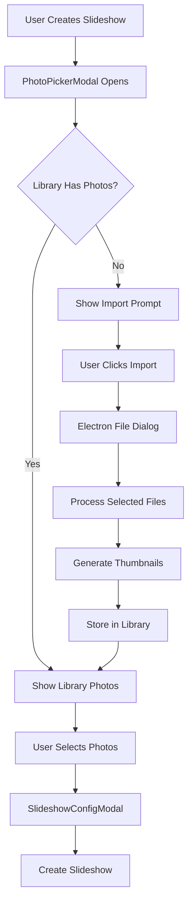

# macOS Photo Import Implementation Plan

## Section 1: Clarifying Questions

Before finalizing the implementation approach, I need clarity on several key decisions:

### Technical Decisions ✅ ANSWERED
1. **Storage Location**: **✅ Hybrid Approach Selected**
   - IndexedDB for metadata + thumbnails (fast access, size-efficient)
   - Original files referenced in place (no duplication, maintains quality)
   - Best balance of performance and storage efficiency

2. **Photo Format Storage**: **✅ Multiple Sizes Selected**
   - Thumbnails (512px JPEG 80% quality) for grid display
   - Reference to full-resolution originals for slideshow playback
   - Optimal memory efficiency and loading performance

3. **Import Behavior**: **✅ Hybrid Reference Approach Selected**
   - Generate and store compressed thumbnails in IndexedDB
   - Reference original file paths (simplest implementation)
   - Validate file existence during slideshow playback

### UX Clarifications ✅ ANSWERED
4. **Photo Picker Default View**: **✅ Library-First Approach**
   - Show app's photo library as primary view
   - Import button prominently displayed when library is empty
   - Seamless transition between library browsing and import

5. **Delete Behavior**: **✅ App-Only Deletion**
   - Remove photos only from app library
   - Keep all original files untouched
   - Simple, safe deletion with no file management complexity

6. **Duplicate Handling**: **✅ Smart Detection with Fallback**
   - Hash-based duplicate detection during import
   - User choice dialog (Skip/Replace/Keep Both) when feasible
   - Fallback: Skip silently with summary message of duplicates skipped

### Migration & Compatibility ✅ ANSWERED
7. **Existing Data**: **✅ No Backward Compatibility Needed**
   - Fresh implementation without migration concerns
   - Existing slideshows can be recreated as needed
   - Focus entirely on optimal new implementation

## Section 2: Overview

### High-Level Summary
Transform the macOS photo handling from a per-slideshow file selection workflow to a persistent photo library system. Users will import photos once into the app's library, then select from this library when creating slideshows. The implementation prioritizes simplicity and optimal performance.

### Key Changes
- **Hybrid Storage Photo Library**: IndexedDB for thumbnails/metadata + file path references for originals
- **Library-First Photo Picker**: Shows user's photo library immediately, with prominent import option
- **Smart Import Flow**: Hash-based duplicate detection with user choice when practical
- **Performance Optimized Storage**: 512px JPEG thumbnails for fast grid display, original references for playback
- **Clean Deletion UX**: Remove from app library only, preserve all original files

### Benefits
- **Faster Slideshow Creation**: Instant access to thumbnail grid, no filesystem browsing
- **Photo Reuse**: Build photo collection over time, reuse across unlimited slideshows
- **Memory Efficient**: Compressed thumbnails for browsing, full resolution on-demand
- **Storage Efficient**: No file duplication, references to original locations
- **Simple & Safe**: App-only deletion, no file management complexity

## Section 3: Current State Analysis

### How Things Work Now
1. **SlideshowsTab**: Clicking "+ New Slideshow" opens PhotoPickerModal
2. **PhotoPickerModal**: On macOS, shows virtual "Select from Files" album
3. **File Selection**: Clicking album opens Electron file dialog via [`selectPhotosFromFiles()`](src/services/PhotoService.ts:448)
4. **One-time Use**: Selected photos are used only for that slideshow
5. **Storage**: Photos stored per-slideshow in [`StorageService`](src/services/StorageService.ts:314) as blob URLs

### What Needs to Change
1. **Photo Library**: Need persistent library storage separate from individual slideshows
2. **Import Workflow**: Add photo import functionality to build library over time
3. **Picker Enhancement**: Show library photos first, with import option when needed
4. **Storage Strategy**: Optimize for efficient storage and memory usage
5. **UX Flow**: Streamline from "file selection per slideshow" to "library selection"

### Existing Infrastructure We Can Leverage
- ✅ **Storage System**: [`StorageService`](src/services/StorageService.ts) already handles platform routing (Electron vs Capacitor)
- ✅ **Photo Store**: [`photoStore.ts`](src/stores/photoStore.ts) has library management and cache eviction
- ✅ **Photo Types**: [`Photo interface`](src/types/index.ts:12) and storage keys already defined
- ✅ **File Dialog**: [`selectPhotosFromFiles()`](src/services/PhotoService.ts:448) already working for file selection
- ✅ **Drag & Drop**: [`PhotoPickerModal`](src/components/PhotoPickerModal.tsx:277) already has drag/drop support

## Section 4: Technical Approach

### Storage Strategy
**Implementation: Hybrid Reference Approach**
- **Thumbnails + Metadata in IndexedDB**: Via existing [`StorageService`](src/services/StorageService.ts)
  - Photo metadata (filename, timestamp, import date, file hash)
  - Compressed thumbnails (512px max, JPEG 80% quality) for instant grid display
  - Original file path references for slideshow playback
- **Original Files**: Referenced in place, not copied
  - Zero storage duplication (simplest approach)
  - Maintains perfect original quality
  - Fast app startup and memory efficiency

### Architecture Changes

#### Photo Service Enhancements
Extend [`PhotoService.ts`](src/services/PhotoService.ts) with:
- `importPhotosToLibrary()` - Import and store photos permanently
- `getLibraryPhotos()` - Retrieve all photos from app library
- `deleteFromLibrary()` - Remove photos from library
- `validatePhotoExists()` - Check if referenced originals still exist

#### Storage Service Extensions
Extend [`StorageService.ts`](src/services/StorageService.ts) with:
- Enhanced photo storage with thumbnail management
- Import metadata tracking (import date, source path)
- Cleanup utilities for orphaned data

#### UI Component Updates
- **PhotoPickerModal**: Show library first, add import button/section
- **Photo Library Manager**: New component for managing imported photos
- **Import Progress UI**: Show progress during bulk photo import

### Data Flow



### File Organization
```
src/
├── services/
│   ├── PhotoService.ts          # Enhanced with library methods
│   ├── PhotoLibraryService.ts   # New: Library-specific operations
│   └── StorageService.ts        # Enhanced photo storage
├── components/
│   ├── PhotoPickerModal.tsx     # Enhanced with library view
│   ├── PhotoImportModal.tsx     # New: Import progress/options
│   └── PhotoLibraryManager.tsx  # New: Library management
└── stores/
    └── photoStore.ts            # Enhanced with library operations
```

## Section 5: Implementation Stages

### Stage 1: Core Library Storage
**Goal**: Implement persistent photo library storage
- Enhance [`PhotoService`](src/services/PhotoService.ts) with library management methods
- Create [`PhotoLibraryService`](src/services/PhotoLibraryService.ts) for advanced operations
- Enhanced [`StorageService`](src/services/StorageService.ts) for photo library storage
- Update [`photoStore`](src/stores/photoStore.ts) with library operations
- Add storage keys and types for library metadata

**Deliverables**:
- Photos can be imported and stored permanently
- Library photos can be retrieved and managed
- Storage handles thumbnails and metadata efficiently
- Basic validation and error handling

### Stage 2: Enhanced Photo Picker
**Goal**: Update PhotoPickerModal to show library photos first
- Modify [`PhotoPickerModal`](src/components/PhotoPickerModal.tsx) UI to show library by default
- Add "Import Photos" section/button when library is empty
- Enhance photo grid to show library photos with selection
- Integrate existing drag & drop with library import
- Add photo management options (delete from library)

**Deliverables**:
- PhotoPickerModal shows library photos on open
- Import functionality integrated into picker
- Seamless UX between library browsing and import
- Drag & drop imports directly to library

### Stage 3: Import Flow & Progress
**Goal**: Polished import experience with progress feedback
- Create [`PhotoImportModal`](src/components/PhotoImportModal.tsx) for bulk import progress
- Add thumbnail generation with progress indication
- Implement duplicate detection and handling
- Add import options (quality settings, organization)
- Error handling for corrupted files or permission issues

**Deliverables**:
- Smooth bulk import experience with progress
- Smart duplicate handling
- Robust error handling and recovery
- Import options for power users

### Stage 4: Integration & Flow Updates
**Goal**: Update slideshow creation flow to use new library system
- Modify [`SlideshowsTab`](src/pages/SlideshowsTab.tsx) to immediately open enhanced photo picker
- Update slideshow storage to reference library photos (by photo ID)
- Update photo references in existing components to handle library photos
- Integration testing across the full flow
- File existence validation during slideshow playback

**Deliverables**:
- Complete new slideshow creation flow using photo library
- Updated photo references throughout app
- Robust file validation and error handling
- Full integration testing from library to slideshow playback

### Stage 5: Photo Library Management
**Goal**: Advanced photo library management features
- Create [`PhotoLibraryManager`](src/components/PhotoLibraryManager.tsx) component for settings/management
- Implement app-only photo deletion (preserve originals)
- Add storage cleanup and optimization utilities
- Performance optimizations for large libraries (virtual scrolling, lazy loading)
- Add basic photo organization (by import date, filename)

**Deliverables**:
- Complete photo library management interface
- Safe deletion with original file preservation
- Storage optimization and cleanup tools
- Performance optimizations for large photo collections

## Section 6: Considerations & Edge Cases

### Performance Considerations
- **Memory Management**: Large photo libraries need careful memory handling
  - Use existing cache eviction logic in [`photoStore`](src/stores/photoStore.ts:85)
  - Implement virtual scrolling for large photo grids
  - Lazy loading of thumbnails in PhotoPickerModal
- **Storage Optimization**: IndexedDB efficient with file references
  - Only store small thumbnails (~10-50KB each) and metadata in IndexedDB
  - Monitor storage usage and show warnings at 80% capacity
  - Easy cleanup via library management interface

### Edge Cases
- **File Not Found**: Original photos moved/deleted after import
  - Validate file existence before slideshow playback
  - Show warning: "Photo not found" with thumbnail fallback
  - Option to locate moved file or remove from library
  - Graceful slideshow continuation with available photos
- **Storage Full**: IndexedDB quota approached
  - Storage usage monitoring with proactive warnings
  - Guided cleanup suggestions (oldest imports, unused photos)
  - Manual photo deletion from library interface
- **Duplicate Photos**: Same photo imported multiple times
  - Fast hash-based duplicate detection during import
  - **Smart handling**: User choice dialog (Skip/Replace/Keep Both) when practical
  - **Fallback**: Skip duplicates silently + summary message ("5 duplicates skipped")
  - Clear import progress feedback with duplicate count

### Safe Deletion Behavior
- **App-Only Deletion**: Photos removed from library only
  - Preserve all original files in their locations
  - No file system operations or permissions needed
  - Simple and zero-risk deletion UX
  - Clear messaging: "Removed from library (originals preserved)"

### Future Enhancements (Out of Scope)
- **Cloud Storage**: Sync photos across devices
- **Photo Editing**: Basic editing within the app
- **Smart Albums**: Auto-organization by date/location
- **Batch Operations**: Select multiple photos for bulk actions
- **Advanced Search**: Search by filename, date, metadata