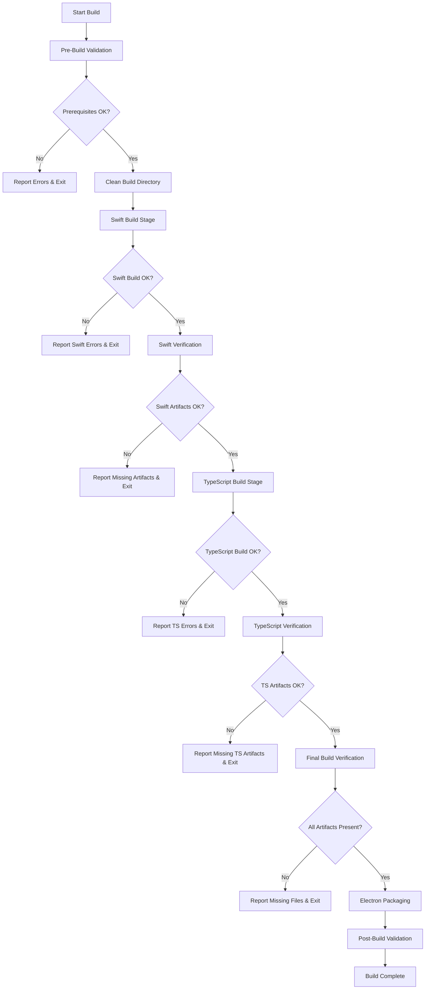

# Robust Build Process Architecture for Electron Application

## Overview

This document outlines the comprehensive build architecture designed to address critical build failures in the Electron application. The primary issue is that [`electron/index.js`](electron/index.js:1) requires `'./build/src/index.js'`, but the build process doesn't guarantee this file exists before packaging.

## Root Causes Analysis

1. **TypeScript compilation not guaranteed to run before packaging** (95% confidence)
2. **Build chain failure if Swift build fails silently** (90% confidence)  
3. **Timing issues where `build/` doesn't exist when electron-builder runs** (70% confidence)
4. **Silent TypeScript compilation errors not surfacing** (65% confidence)

## Architecture Principles

- **Fail-Fast Strategy**: Stop immediately on any failure to prevent incomplete builds
- **Explicit Verification**: Each stage must verify its outputs before proceeding
- **Comprehensive Error Reporting**: All errors collected with clear guidance
- **Atomic Operations**: Each build step completes successfully or fails cleanly

## Build Pipeline Flow



## Detailed Build Stages

### 1. Pre-Build Validation
**Script**: `scripts/validate-build-env.sh`

**Checks**:
- Swift compiler (`swiftc`) availability
- TypeScript compiler (`tsc`) installation and version
- Required dependencies in node_modules
- Source file existence (Swift files, TypeScript entry points)
- Build directory permissions

**Exit Conditions**: Any missing prerequisite fails the build

### 2. Swift Build Stage
**Script**: Enhanced `scripts/build-swift.sh`

**Process**:
- Execute existing Swift compilation
- Verify output library exists: `build/native/libPhotosLibraryBridge.dylib`
- Check library architecture compatibility
- Verify assets copy: `assets/libPhotosLibraryBridge.dylib`

**Verification Points**:
- Library file size > 0 bytes
- `lipo -archs` shows both x86_64 and arm64
- File permissions are executable

### 3. TypeScript Build Stage
**Script**: Enhanced TypeScript compilation with verification

**Process**:
- Run `tsc` with explicit error capture
- Verify primary output: `build/src/index.js`
- Check all TypeScript source files compiled
- Validate module resolution

**Verification Points**:
- `build/src/index.js` exists and is valid JavaScript
- All imports can be resolved
- No compilation errors in stdout/stderr

### 4. Final Build Verification
**Script**: `scripts/verify-build-artifacts.sh`

**Required Artifacts**:
```
build/
├── src/
│   ├── index.js ✓ (Main entry point)
│   ├── preload.js ✓
│   ├── setup.js ✓
│   └── menu.js ✓
├── native/
│   └── libPhotosLibraryBridge.dylib ✓
assets/
└── libPhotosLibraryBridge.dylib ✓ (Copy for packaging)
```

**Verification Checks**:
- All files exist with expected content
- Entry point `require('./build/src/index.js')` can be resolved
- No circular dependencies

## Error Detection & Reporting

### Error Classification
1. **Environment Errors**: Missing tools, permissions
2. **Swift Build Errors**: Compilation failures, missing libraries
3. **TypeScript Errors**: Compilation failures, type errors
4. **Artifact Errors**: Missing or corrupted build outputs

### Error Reporting Format
```bash
[ERROR] Build Stage: <stage-name>
[ERROR] Type: <error-type>
[ERROR] Description: <detailed-message>
[ERROR] Fix: <actionable-solution>
[ERROR] Logs: <path-to-detailed-logs>
```

### Error Log Management
- All build output captured to `electron/build/logs/`
- Separate log files per stage
- Error summary aggregated for final report

## New NPM Scripts Structure

### Core Build Scripts
```json
{
  "scripts": {
    "prebuild": "./scripts/validate-build-env.sh",
    "build:swift:verified": "./scripts/build-swift.sh && ./scripts/verify-swift-build.sh",
    "build:ts:verified": "tsc && ./scripts/verify-ts-build.sh", 
    "build:verified": "./scripts/build-orchestrator.sh",
    "build:artifacts": "./scripts/verify-build-artifacts.sh",
    "build:safe": "npm run build:verified && npm run build:artifacts"
  }
}
```

### Enhanced Build Scripts
```json
{
  "build:mac:safe": "npm run build:safe && electron-builder --mac --publish never",
  "build:mac:clean": "npm run build:clean && npm run build:mac:safe",
  "build:clean": "rm -rf build dist && mkdir -p build/logs"
}
```

## Verification Scripts Design

### Swift Build Verification
**File**: `scripts/verify-swift-build.sh`
```bash
#!/bin/bash
# Verify Swift build outputs
DYLIB_PATH="build/native/libPhotosLibraryBridge.dylib"
ASSETS_PATH="assets/libPhotosLibraryBridge.dylib"

# Check library exists and has content
if [[ ! -f "$DYLIB_PATH" ]] || [[ ! -s "$DYLIB_PATH" ]]; then
    echo "[ERROR] Swift library not created: $DYLIB_PATH"
    exit 1
fi

# Verify universal binary
if ! lipo -archs "$DYLIB_PATH" | grep -q "x86_64 arm64"; then
    echo "[ERROR] Swift library missing required architectures"
    exit 1
fi

# Verify assets copy
if [[ ! -f "$ASSETS_PATH" ]]; then
    echo "[ERROR] Swift library not copied to assets: $ASSETS_PATH"
    exit 1
fi

echo "[SUCCESS] Swift build verification complete"
```

### TypeScript Build Verification
**File**: `scripts/verify-ts-build.sh`
```bash
#!/bin/bash
# Verify TypeScript build outputs
INDEX_PATH="build/src/index.js"

# Check main entry point
if [[ ! -f "$INDEX_PATH" ]]; then
    echo "[ERROR] TypeScript build failed: Missing $INDEX_PATH"
    exit 1
fi

# Verify JavaScript is valid
if ! node -c "$INDEX_PATH" 2>/dev/null; then
    echo "[ERROR] Generated JavaScript has syntax errors: $INDEX_PATH"
    exit 1
fi

# Check for common build artifacts
REQUIRED_FILES=(
    "build/src/preload.js"
    "build/src/setup.js" 
    "build/src/menu.js"
)

for file in "${REQUIRED_FILES[@]}"; do
    if [[ ! -f "$file" ]]; then
        echo "[WARNING] Expected TypeScript output missing: $file"
    fi
done

echo "[SUCCESS] TypeScript build verification complete"
```

## Build Process Testing Strategy

### Testing Levels
1. **Unit Tests**: Individual script validation
2. **Integration Tests**: End-to-end build pipeline
3. **Failure Tests**: Intentional failure scenarios
4. **Performance Tests**: Build timing benchmarks

### Test Scenarios
```bash
# Test 1: Clean build success
npm run build:clean && npm run build:safe

# Test 2: Swift failure handling  
rm electron/src/native/*.swift && npm run build:safe

# Test 3: TypeScript failure handling
echo "invalid typescript" >> electron/src/index.ts && npm run build:safe

# Test 4: Missing artifacts detection
rm build/src/index.js && npm run build:artifacts
```

## Rollback and Cleanup Mechanisms

### Build Failure Cleanup
- Automatic cleanup of partial build artifacts
- Build log preservation for debugging
- Restoration of previous working build if available

### Build State Management
- Track successful build checksums
- Maintain backup of last working build
- Clear failure indicators on successful build

## Implementation Priority

1. **High Priority**: Pre-build validation and artifact verification
2. **Medium Priority**: Enhanced error reporting and logging
3. **Low Priority**: Build performance optimization and caching

## Success Metrics

- **Zero incomplete builds reaching packaging**
- **Clear error messages for all failure types**  
- **Build success rate > 95% on clean environment**
- **Mean time to identify build issues < 2 minutes**

## Migration Path

1. Implement validation scripts alongside existing build process
2. Test new scripts in parallel with current build
3. Gradually replace current npm scripts with verified versions
4. Full cutover once validation is complete

This architecture ensures that the critical failure of `Error: Cannot find module './build/src/index.js'` can never occur in packaged applications.